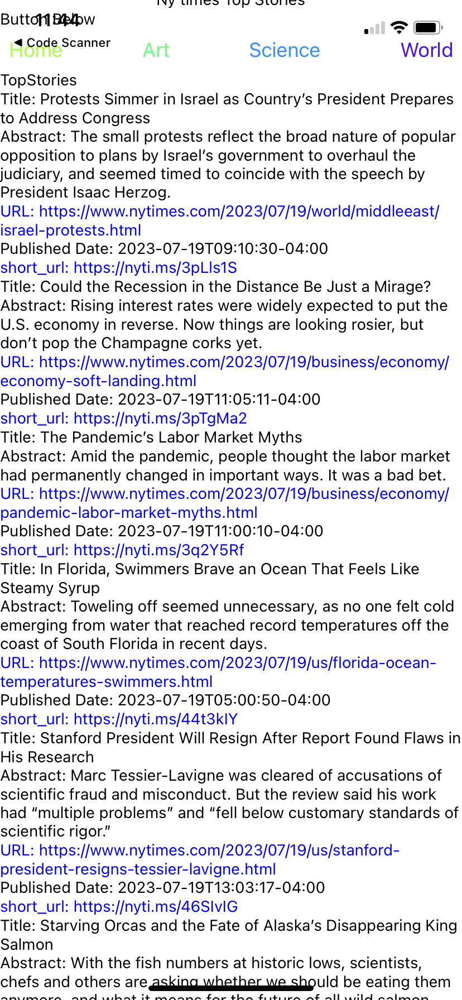
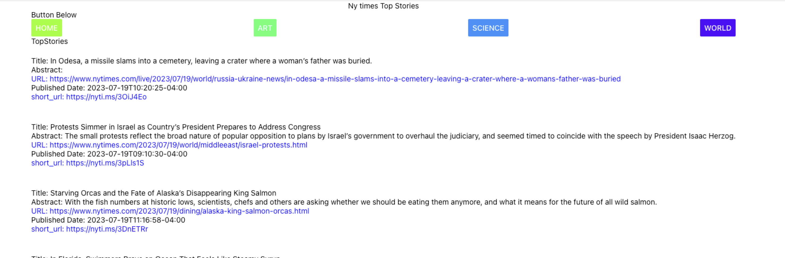

#  NYTimes - Mobile

#### By Qian Li, Joe Wahbeh and Sam Adams😊

#### An Practice React Native project which use NY Times API and a React Native front end to see the top stories on your mobile device. The project is bootstrapped with `npx create-expo-app`.

## 🌼 Technologies Used

* _React_
* _React Native_
* _JSX_
* _Node.js_
* _javascript_
* VS Code

## 🌺 Description

* A user can see a list of top stories with title and abstract from NY Times.

## 🏵️ Setup/Installation Requirements

* Go to `https://github.com/nancyliqn91/NYTimes-Mobile` to clone the GitHub repository.
* In your terminal/command line, go into the folder that was cloned and run `npm install`, this will downloading all the package dependencies.
* Next run `npm run web` to start the server. Once the server loads, the webpage should load automatically but if not type in the localhost route that your terminal shows like `http://localhost:19006/`.
* Next run `npx expo start` to run your React Native application !
Install the Expo Go app on your iOS or Android phone and connect to the same wireless network as your computer. On Android, use the Expo Go app to scan the QR code from your terminal to open your project. On iOS, use the built-in QR code scanner of the default iOS Camera app. Make sure to use the same wifi with your computer.

## 🌻 Iphone and Web Screenshot

### Iphone 

### Web

## 🌷 Known Bugs

* The buttons on the top, only clickable on phone. 
* Please reach out with any found bugs, questions, or concerns to nancyliqn91@gmail.com

## 🌹 License
[MIT](license.txt)
Copyright (c) 2023 Qian Li, Joe Wahbeh, Sam Adams
